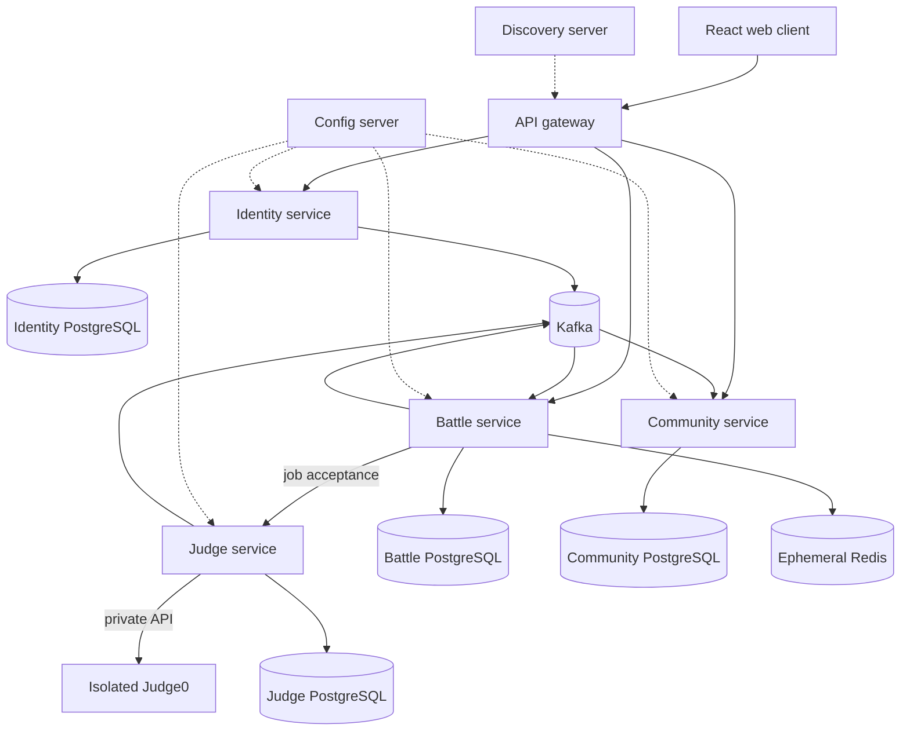

# System context

Owner: 윤서진  
Status: Initial baseline

The browser never calls Judge0 or a service database directly. Managed AWS products are deployment choices for these boundaries, not additional domain owners.

