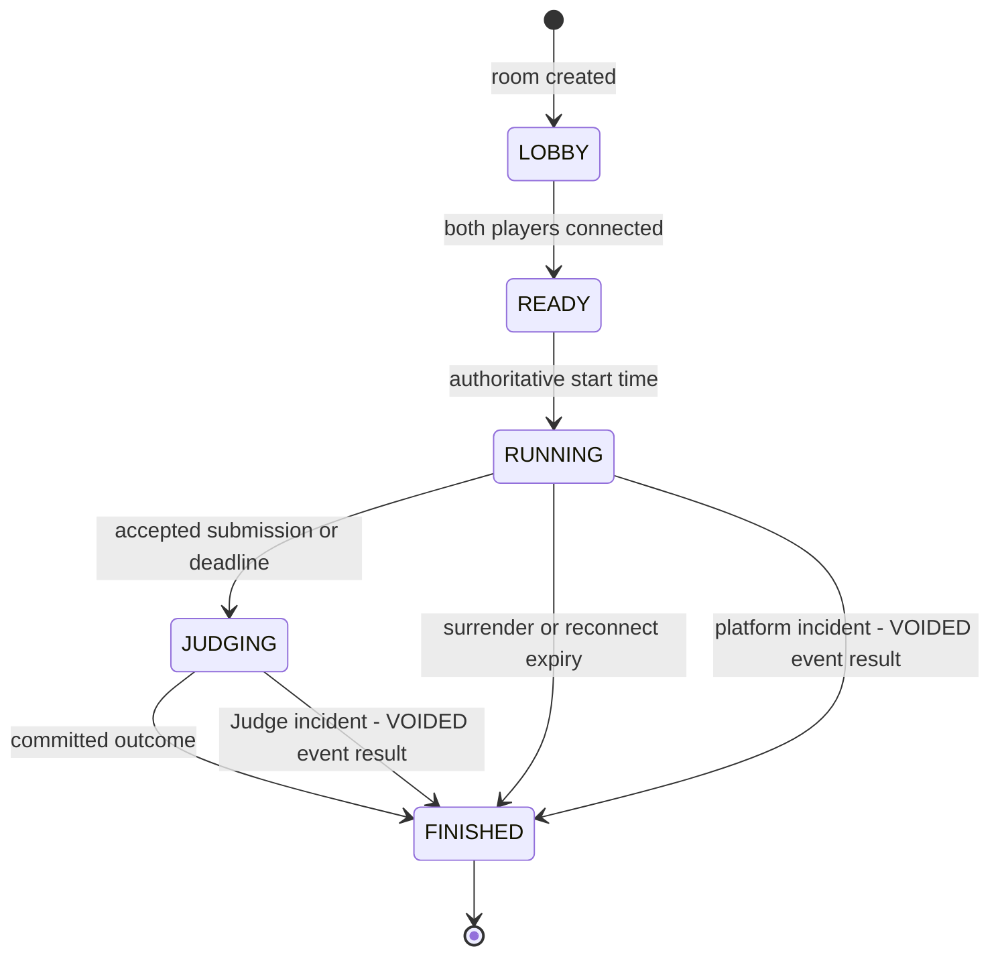

# Ranked match workflow

Owner: 최정민

Status: Target logical baseline; implementation evidence pending

Last verified: 2026-08-14 against `docs/specs/d3-mvp.md` and versioned contract stubs

Requirements: D3-BTL-001 through D3-BTL-005, D3-JDG-001, D3-STAT-001

This diagram is the intended Scenario A workflow. It defines ownership and evidence hand-offs; it does not claim that the current scaffold executes the flow.

```mermaid
sequenceDiagram
  autonumber
  actor A as Player A
  actor B as Player B
  participant WA as Web A
  participant WB as Web B
  participant G as API Gateway
  participant BT as Battle service
  participant J as Judge service
  participant J0 as Isolated Judge0
  participant K as Kafka
  participant C as Community service

  A->>WA: Select language and enter ranked queue
  B->>WB: Select language and enter ranked queue
  WA->>G: Join ranked queue
  WB->>G: Join ranked queue
  G->>BT: Authenticated queue commands
  BT->>BT: Match by language and widening rating window
  BT-->>G: Room, state, server start and deadline
  G-->>WA: Forward authorized room event
  G-->>WB: Forward authorized room event

  loop Running match
    WA->>G: Progress or attack command
    WB->>G: Progress or attack command
    G->>BT: Authorized room command
    BT->>BT: Validate state, energy and sequence
    BT-->>G: Per-player state and masked opponent activity
    G-->>WA: Forward Player A event
    G-->>WB: Forward Player B event
  end

  A->>WA: Run public examples or submit hidden tests
  WA->>G: Run or submit command
  G->>BT: Match-scoped command
  BT->>J: Accept versioned judge job
  J-->>BT: Stable submission ID
  BT->>BT: Persist submission-to-match, player, mode and command id correlation
  J->>J0: Execute within pinned limits
  J0-->>J: Raw execution result
  J->>J: Normalize and persist evidence
  J-->>K: submission.judged.v1
  K-->>BT: Idempotent judged event
  BT->>BT: Correlate event by stored mode and command id
  alt RUN result or non-accepted SUBMIT
    BT-->>G: Return bounded judge status; keep match RUNNING
    G-->>WA: Forward caller-visible result
  else First accepted SUBMIT
    BT->>BT: Lock solver and close new submissions at server acceptance time
    BT->>BT: Await SUBMIT jobs already accepted before the cutoff
    Note over BT,J: Finish when cutoff jobs resolve or a bounded judging timeout expires
    BT->>BT: Include a second accepted cutoff job in both-solve scoring
    Note over BT,J: Outcome calculation waits for an approved safe scoring-evidence boundary
    BT->>BT: Commit outcome, named score components and calculation version
    BT-->>G: Per-player final outcome, score, rating and RP
    G-->>WA: Forward Player A result
    G-->>WB: Forward Player B result
    BT-->>K: match.finished.v1 and rating.changed.v1
    K-->>C: Idempotent projection events
    C->>C: Build result post and searchable record
  else Authoritative match deadline
    BT->>BT: Await accepted in-flight SUBMIT jobs within the bounded judging timeout
    Note over BT,J: Outcome calculation waits for an approved safe scoring-evidence boundary
    BT->>BT: Commit outcome, named score components and calculation version
    BT-->>G: Per-player final outcome, score, rating and RP
    G-->>WA: Forward Player A result
    G-->>WB: Forward Player B result
    BT-->>K: match.finished.v1 and rating.changed.v1
    K-->>C: Idempotent projection events
    C->>C: Build result post and searchable record
  end
```

## Server-owned lifecycle



`FINISHED` is the single terminal aggregate state. Normal completion, surrender, reconnect expiry and confirmed platform incidents differ through the committed outcome and reason. The domain void outcome is serialized as `match.finished.v1.result = VOIDED`; it is not a separate lifecycle state. The service persists that result before publishing projections. Redis may hold expiring queue, presence, reconnect, or fan-out state, but loss of Redis must not erase a committed outcome.

## Exception and recovery branches

| Trigger | Authoritative owner | Required result | Acceptance evidence |
|---|---|---|---|
| Browser disconnects | Battle | Mark disconnected; continue timer; accept resume for 30 seconds | Two-session reconnect test with server timestamps |
| Reconnect expires | Battle | Opponent victory exactly once | Boundary-time unit test and idempotent result integration test |
| Player surrenders | Battle | Opponent victory immediately | State transition test and both-client event evidence |
| User-code failure | Judge | Classified compilation, runtime, timeout, memory or wrong-answer result | Normalization tests per supported language |
| Platform or Judge incident | Judge then Battle | Finish once with domain void outcome, serialize public result as `VOIDED`, retain incident reason, and leave rating/RP unchanged | Terminal-state test, event contract assertion, incident correlation and zero-adjustment assertion |
| Duplicate judged/event delivery | Receiving service | Apply once using inbox or aggregate version | Container-backed replay test |
| Community projection delay | Community | Preserve traceable aggregate ID; converge asynchronously | Replayable projection and source-event trace |

## Privacy and trust boundaries

- The Web client may render only masked opponent activity during the match. Identifiers, literals and source stay outside opponent events.
- API Gateway is the browser's only ingress. HTTP and WebSocket returns shown above pass from Battle through the Gateway; the browser never connects to Battle directly.
- Client timing and syntax analysis are display hints; Battle owns deadlines, energy and results.
- Only Judge communicates with Judge0. Judge events expose classified evidence, not private source or hidden tests.
- Community owns projections, not identity, rating or match truth.

## Contract activation state

Judge HTTP v1 defines the synchronous acceptance response, stable submission ID, idempotency conflict, mapped-runtime unavailable state, and a Judge-owned privacy-safe evidence read. Battle must still durably map the accepted submission ID to match, player, attempt, `RUN`/`SUBMIT` mode and stable command ID before acknowledging the browser command. Each distinct `RUN` uses a new command ID without incrementing the submission attempt; a retry reuses its command ID. `submission.judged.v1` remains a bounded completion notification, after which Battle reads the persisted correctness and repeated size-tier runtime summary without receiving source, hidden cases, compiler commands, or raw diagnostics.

The contract and deterministic fake adapter are active, but durable Judge persistence, asynchronous processing/outbox publication, authenticated HTTP handlers, Battle consumption, and the real Judge0 runtime matrix remain incomplete. They require issue #13 implementation evidence and separate issue #14 real-Judge smoke evidence before Scenario A can claim a working Judge flow.

The current `match.finished.v1` contains only match ID, result, ranked flag, and seat-ordered player IDs; its schema now defines index 0 as `PLAYER_ONE` and index 1 as `PLAYER_TWO`, so a basic winner projection is unambiguous. `rating.changed.v1` provides current rating/RP and an unconstrained tier string, but no independently defined division, leaderboard, language, or peak data; division display remains blocked until a compatible structured representation or new versioned boundary is approved. `user-profile.changed.v1` provides handle but not display name. None of those schemas carries the score composition, attempts, attack history, or execution summary represented by the target record model.

Before Community implements enriched result/profile projections, the team must approve either a new versioned safe-summary event contract or a bounded, versioned read API/read model owned by Battle or Identity. Community may consume that contract and store its own projection; it may not query another service database. The current v1 stubs prove schema shape only and are insufficient completion evidence for detailed D3-STAT-001 records.

Related sources: [MVP specification](../specs/d3-mvp.md), [service boundaries](services.md), [logical ERD](erd.dbml), [test plan](../quality/test-plan.md), and [demo runbook](../operations/demo-runbook.md).
