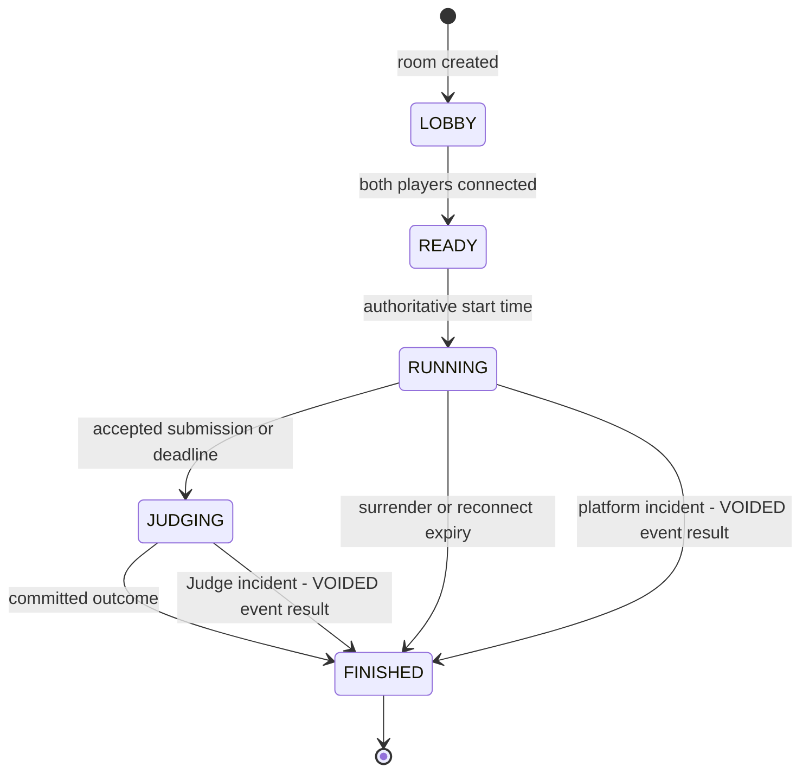

# Ranked match workflow

Owner: 최정민

Status: Local P0 workflow rehearsed with the deterministic fake judge; final RC and live Judge0 application evidence pending

<<<<<<< HEAD
Last verified: 2026-08-19 against `c738cd8`, the 2026-08-18 two-browser rehearsal, the fresh RC acceptance and merged PRs #89/#96/#98/#103

Requirements: D3-BTL-001 through D3-BTL-005, D3-JDG-001, D3-STAT-001

This diagram defines the Scenario A ownership and evidence hand-offs. The flow through sign-in, feed, ranked queue, Run/Submit, reconnect, result, rating/RP, result post and public record was rehearsed on frozen revision `25359ad` and passed the fresh RC `c738cd8` two-session acceptance on 2026-08-19 (zero manual database edits, both-accepted early finish, match `30e8b599`); the live Judge0 application E2E remains pending.
=======
Last verified: 2026-08-19 against `c738cd8`, the 2026-08-18 two-browser rehearsal and merged PRs #89/#96

Requirements: D3-BTL-001 through D3-BTL-005, D3-JDG-001, D3-STAT-001

This diagram defines the Scenario A ownership and evidence hand-offs. The flow through sign-in, feed, ranked queue, Run/Submit, reconnect, result, rating/RP, result post and public record was rehearsed on frozen revision `25359ad` and passed the fresh RC `c738cd8` two-session acceptance on 2026-08-19 (zero manual database edits, match `30e8b599`); the live Judge0 application E2E remains pending.
>>>>>>> origin/main

```mermaid
sequenceDiagram
  autonumber
  actor A as Player A
  actor B as Player B
  participant WA as Web A
  participant WB as Web B
  participant G as API Gateway
  participant BT as Battle service
  participant J as Judge service
  participant J0 as Isolated Judge0
  participant K as Kafka
  participant C as Community service

  A->>WA: Select language and enter ranked queue
  B->>WB: Select language and enter ranked queue
  WA->>G: Join ranked queue
  WB->>G: Join ranked queue
  G->>BT: Authenticated queue commands
  BT->>BT: Match by language and widening rating window
  BT-->>G: Room, state, server start and deadline
  G-->>WA: Forward authorized room event
  G-->>WB: Forward authorized room event

  loop Running match
    WA->>G: Progress or attack command
    WB->>G: Progress or attack command
    G->>BT: Authorized room command
    BT->>BT: Validate state, energy and sequence
    BT-->>G: Per-player state and masked opponent activity
    G-->>WA: Forward Player A event
    G-->>WB: Forward Player B event
  end

  A->>WA: Run public examples or submit hidden tests
  WA->>G: Run or submit command
  G->>BT: Match-scoped command
  BT->>J: Accept versioned judge job
  J-->>BT: Stable submission ID
  BT->>BT: Persist submission-to-match, player, mode and command id correlation
  J->>J0: Execute within pinned limits
  J0-->>J: Raw execution result
  J->>J: Normalize and persist evidence
  J-->>K: submission.judged.v1
  K-->>BT: Idempotent judged event
  BT->>BT: Correlate event by stored mode and command id
  alt RUN result or non-accepted SUBMIT
    BT-->>G: Return bounded judge status; keep match RUNNING
    G-->>WA: Forward caller-visible result
  else ACCEPTED SUBMIT
    BT->>BT: Lock solver and close new submissions at server acceptance time
    alt Both participants hold an accepted SUBMIT
      BT->>BT: Begin JUDGING early and publish the latest snapshot
      Note over BT,J: Existing result poller calculates outcome from committed safe evidence
      BT->>BT: Commit outcome, named score components and calculation version
      BT-->>G: Per-player final outcome, score, rating and RP
      G-->>WA: Forward Player A result
      G-->>WB: Forward Player B result
      BT-->>K: match.finished.v1 and rating.changed.v1
      K-->>C: Idempotent projection events
      C->>C: Build result post and searchable record
    else Only one participant holds an accepted SUBMIT
      BT-->>G: Return self-only accepted lock; keep match RUNNING
    end
  else Authoritative match deadline
    BT->>BT: Await accepted in-flight SUBMIT jobs within the bounded judging timeout
    Note over BT,J: Outcome calculation waits for an approved safe scoring-evidence boundary
    BT->>BT: Commit outcome, named score components and calculation version
    BT-->>G: Per-player final outcome, score, rating and RP
    G-->>WA: Forward Player A result
    G-->>WB: Forward Player B result
    BT-->>K: match.finished.v1 and rating.changed.v1
    K-->>C: Idempotent projection events
    C->>C: Build result post and searchable record
  end
```

## Server-owned lifecycle



`FINISHED` is the single terminal aggregate state. Normal completion, surrender, reconnect expiry and confirmed platform incidents differ through the committed outcome and reason. The domain void outcome is serialized as `match.finished.v1.result = VOIDED`; it is not a separate lifecycle state. The service persists that result before publishing projections. A deadline poll commits its bounded PostgreSQL batch before asynchronous match-ID fan-out, so Redis latency cannot hold later claims open. Redis may hold expiring queue, presence, reconnect, or fan-out state, but loss of Redis must not erase a committed outcome. A Battle instance periodically re-reads PostgreSQL for its active local WebSocket matches, so a pub/sub notification missed during subscriber recovery converges to the latest aggregate version; transient read failures defer that cycle without creating a disconnect result.

### Current submission boundary

An accepted `SUBMIT` locks that player's accepted submission but does not by itself finish the match. When **both** participants have an accepted `SUBMIT`, Battle transitions `RUNNING → JUDGING` early and the existing result poller calculates the outcome. If only one participant has accepted, the server-owned deadline remains the normal transition to `JUDGING`. Surrender, reconnect expiry, and classified platform incidents remain separate terminal paths.

## Exception and recovery branches

| Trigger | Authoritative owner | Required result | Acceptance evidence |
|---|---|---|---|
| Browser disconnects | Battle | Mark disconnected; continue timer; accept resume for 30 seconds | Two-session reconnect test with server timestamps |
| Reconnect expires | Battle | Opponent victory exactly once | Boundary-time unit test and idempotent result integration test |
| Player surrenders | Battle | Opponent victory immediately | State transition test and both-client event evidence |
| User-code failure | Judge | Classified compilation, runtime, timeout, memory or wrong-answer result | Normalization tests per supported language |
| Platform or Judge incident | Judge then Battle | Finish once with domain void outcome, serialize public result as `VOIDED`, retain incident reason, and leave rating/RP unchanged | Terminal-state test, event contract assertion, incident correlation and zero-adjustment assertion |
| Duplicate judged/event delivery | Receiving service | Apply once using inbox or aggregate version | Container-backed replay test |
| Community projection delay | Community | Preserve traceable aggregate ID; converge asynchronously | Replayable projection and source-event trace |

## Privacy and trust boundaries

- The Web client may render only masked opponent activity during the match. Identifiers, literals and source stay outside opponent events.
- API Gateway is the browser's only ingress. HTTP and WebSocket returns shown above pass from Battle through the Gateway; the browser never connects to Battle directly.
- Client timing and syntax analysis are display hints; Battle owns deadlines, energy and results.
- Only Judge communicates with Judge0. Judge events expose classified evidence, not private source or hidden tests.
- Community owns projections, not identity, rating or match truth.

## Contract activation state

Judge HTTP v1 defines synchronous acceptance, stable submission IDs, idempotency conflicts, mapped-runtime unavailable state, and Judge-owned privacy-safe evidence reads. Battle durably maps each accepted submission to match, player, attempt, `RUN`/`SUBMIT` mode and stable command ID before browser acknowledgement, then consumes `submission.judged.v1` and reads the bounded evidence without receiving source, hidden cases, compiler commands, or raw diagnostics. `battle-event.v3` now exposes the latest verdict and accepted lock only to the submitting player's snapshot.

The versioned Judge contract, service-authenticated HTTP handlers, deterministic local fake, durable PostgreSQL storage, fenced asynchronous processing, transactional outbox, Kafka producer, and selectable real Judge0 adapter are implemented. Issue #59 additionally passed the production adapter and six-runtime smoke over an exact source-security-group-only route to the designated Judge0 host. The temporary runner and route were removed after evidence capture; a deployed judge-service application using that path remains **NOT RUN**.

<<<<<<< HEAD
The local Battle flow includes ranked queueing, participant-scoped WebSocket snapshots/commands, judged-event correlation, accepted locking, outcome/rating calculation, and result publication. PR #89 adds heartbeat and reconnect stability; PR #96 adds self-submission verdict/attempt state and accepted locking; PR #98 begins judging early once both participants hold an accepted submit. The two-browser deterministic-fake rehearsal is **PASS** on `25359ad`, and the fresh RC `c738cd8` acceptance (both-accepted early finish, live attack exchange) is **PASS** on 2026-08-19; live Judge0 application execution remains **NOT RUN** as separately stated in the test plan.
=======
The local Battle flow includes ranked queueing, participant-scoped WebSocket snapshots/commands, judged-event correlation, accepted locking, outcome/rating calculation, and result publication. PR #89 adds heartbeat and reconnect stability; PR #96 adds self-submission verdict/attempt state and accepted locking. The two-browser deterministic-fake rehearsal is **PASS** on `25359ad`, and the fresh RC `c738cd8` acceptance (including a live attack exchange with the warning overlay) is **PASS** on 2026-08-19; live Judge0 application execution remains **NOT RUN** as separately stated in the test plan. PR #98 additionally finishes the match immediately once both submissions are accepted, and PR #103 keeps the snapshot sequence stream monotonic across verdict updates and reconnects.
>>>>>>> origin/main

Community's P0 projections are implemented: `match.finished.v1` creates the traceable public record and ranked non-void result post, `rating.changed.v1` updates rating/RP/tier, and `user-profile.changed.v1` updates handle data. PRs #60/#64/#70/#75/#76 provide producer, consumer, replay/order/concurrency safety, and authenticated keyset handle search; issue #17 is closed. Score composition, attempts, attack history, execution summaries, display name, leaderboard, language statistics, and peak tier remain P1 enrichment requiring a privacy-reviewed versioned boundary.

Related sources: [MVP specification](../specs/d3-mvp.md), [service boundaries](services.md), [logical ERD](erd.dbml), [test plan](../quality/test-plan.md), and [demo runbook](../operations/demo-runbook.md).
