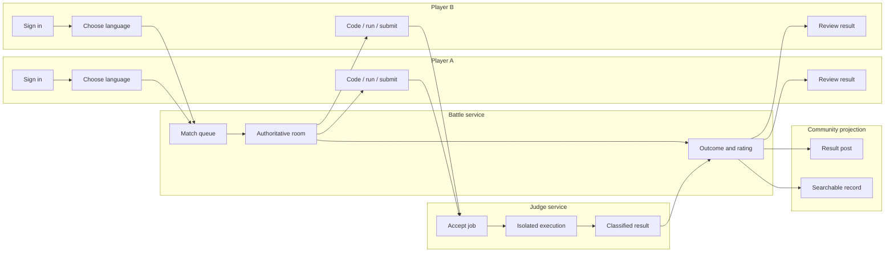

# Ranked match workflow

Owner: 최정민  
Status: Initial baseline  
Requirements: D3-BTL-001 through D3-BTL-005, D3-JDG-001, D3-STAT-001

The final swimlane shall add owner actions, error branches, reconnect, surrender, and the platform-incident void path after the first vertical slice is observable.

