# Deployment plan

Owner: 윤서진

Status: Local runtime active; developer account and isolated Judge0 host bound; application cloud resources and pipeline pending

Last verified: 2026-08-19 against `2915d0f`, the local Compose/CI model and issue #59 source-SG route smoke

Related: [cloud architecture](../architecture/cloud.md), [AWS CLI developer profile](aws-cli-setup.md), [local infrastructure](../../infra/README.md), [test plan](../quality/test-plan.md)

## Deployment truth

The assigned account `811221506617`, Seoul region and lead developer IAM login are confirmed. A dedicated, zero-ingress Judge0 EC2 host is bound and tracked in [`infra/judge/README.md`](../../infra/judge/README.md); its activation is separate from application deployment. `pnpm local:start` has started the full local runtime and produced a green dependency preflight. The current GitHub Actions workflow validates the repository; it does not build or publish container images and does not deploy. ECR, ECS, RDS, ElastiCache, MSK, OIDC and Terraform state remain `UNKNOWN` until IAM, quota and service bindings are reviewed. The sequence below is the gated target, not evidence of an active application pipeline.

## Local profiles

- Default: PostgreSQL databases, Redis and Kafka.
- `observability`: Prometheus and Grafana.
- `judge`: the local profile remains reserved; the bound AWS Judge0 host uses a separately pinned bundle and its own security review.
- Application processes run from the IDE or repository commands during normal development.

The runtime contract is the Docker API and Compose specification. Docker Desktop is the current macOS runtime; another compatible runtime may be used after Compose and Testcontainers checks pass.

## Promotion sequence

```mermaid
flowchart LR
  PR["Pull request"] --> CI["CI: contracts, web, Java, Compose"]
  CI --> Review["Codex review + human approval"]
  Review --> Main["Squash merge to main"]
  Main --> Image["Build and scan immutable images"]
  Image --> Registry["Push digest-tagged images to ECR"]
  Registry --> Approve["Environment approval"]
  Approve --> Migrate["Forward-only Flyway migration job"]
  Migrate --> Deploy["Deploy candidate revision"]
  Deploy --> Verify["Readiness, smoke, contract and preflight"]
  Verify -->|pass| Promote["Promote traffic and record evidence"]
  Verify -->|fail| Rollback["Restore prior image revision"]
  Rollback --> VerifyOld["Verify prior revision and open incident"]
```

### 1. CI gate

On a pull request and `main` push, install pinned toolchains, audit dependencies, validate scaffold/contracts/agent config, type-check/test/build Web, validate the Gradle wrapper, build/test Java and validate Compose profiles. The exact workflow implementation is owned separately; this document consumes its recorded result.

Promotion stops on a required failure. Skipped behavior tests are reported as skips and never converted into a green feature claim.

### 2. Image gate

After a verified `main` build, create one image per deployable application from the same revision. Record source SHA, build time, base-image digest, SBOM, vulnerability scan and resulting image digest. Publish only immutable revision tags and digests; mutable convenience tags are never deployment evidence.

Containerfiles and the registry workflow are not present yet. Image evidence is therefore `NOT RUN`.

### 3. Authentication and approval gate

Use GitHub OIDC with a least-privilege environment role; do not store long-lived AWS keys. The local [`d3` developer profile](aws-cli-setup.md) is for inspected or explicitly approved operator work and is not a CI credential. Protect the target environment with explicit approval. Bind account, region, role ARN, ECR repositories, cluster/service names and secret paths before enabling the job.

Developer authentication does not authorize deployment. The deployment role, approval identity and resource bindings remain `UNKNOWN`, so this plan alone authorizes no cloud mutation.

### 4. Migration gate

Run reviewed, forward-only Flyway migrations with a dedicated migration identity before application traffic promotion. Confirm backups and compatibility with both the previous and candidate application revisions. Network calls do not run inside schema transactions.

Destructive or incompatible migrations require a separate expand-and-contract rollout. Production schema rollback is a forward fix or restore decision, not an automatic down migration.

### 5. Candidate deploy

Deploy digest-pinned application images behind the ALB with no traffic or the smallest supported canary. Judge0 stays on separate private EC2 compute and is never exposed directly. RDS databases and roles remain service-specific; Redis stores only expiring coordination state.

Record deployment ID, image digests, migration version, configuration version, operator and start time.

### Battle WebSocket ingress guardrails (issue #37)

Before exposing the Gateway route `/ws/v1/battle/**`, bind the following controls in the reviewed ALB/WAF deployment configuration and record their final values with the deployment evidence:

- Limit WebSocket upgrade requests at the edge to **12 per source IP per minute**, with a burst of **6**. This limits repeated unauthenticated handshakes before Gateway JWT validation; it is not a substitute for Battle's authenticated `(matchId, viewerId)` one-session ownership.
- Set the ALB idle timeout to **900 seconds**. This covers the current ten-minute authoritative match window without silently severing an otherwise healthy, quiet match. If the match duration changes, review this timeout with the lifecycle owner.
- Retain ALB/Gateway upgrade rejections and Battle's `d3_battle_websocket_sessions_active` gauge. Alert investigation begins on sustained edge throttling, abnormal close rates, or a per-instance session count that does not fall after a match completes.

The local Compose topology has no public ingress and therefore does not emulate these ALB/WAF controls. The application route must not be promoted until the cloud binding is recorded; production values are a deployment configuration, not a claim that this document configured AWS.

### 6. Verify and promote

Require readiness for gateway and all domain services, database/broker/cache connectivity, contract smoke, one sanitized identity request and `pnpm demo:preflight` against the target. A Judge deployment additionally requires the pinned six-language smoke matrix and resource-limit/isolation checks.

Promote traffic only when the required checks pass. Archive results with the revision and environment; health alone does not prove Scenario A.

### 7. Rollback

Rollback triggers include failed readiness, rising required-request errors, contract incompatibility, duplicate results, authorization/privacy regression or failed Judge smoke. Stop promotion, route traffic to the last verified image digests, verify readiness and domain smoke, then open an incident with the correlation and deployment IDs.

Keep a compatible previous application revision available. Do not automatically reverse a committed database migration. If the schema is incompatible or data integrity is uncertain, stop writes and choose a reviewed forward fix or backup restore.

## Cloud target

- Application containers: ECS Fargate behind an ALB.
- Images: ECR, published only after a verified `main` build.
- Durable data: RDS PostgreSQL with service-specific databases and credentials.
- Ephemeral data: ElastiCache Redis.
- Events: Amazon MSK when the assigned quota permits it.
- User-code execution: separate zero-ingress Judge0 EC2; migration from its bootstrap public subnet to the final private-service path remains pending.
- Optional media: S3 presigned upload and CloudFront only after P1 activation.
- Secrets: Secrets Manager or Parameter Store; CI authentication through GitHub OIDC.

## Local and EC2 fallback

When managed services or permissions are unavailable, run application images with Compose on one application EC2 host while preserving a separate Judge0 host. If no cloud host is available, rehearse the same verified revision locally. The fallback must pass its own preflight and be identified in the presentation; it is not evidence that the target managed architecture was deployed.

## Unresolved bindings

- Application IAM boundary, quotas, DNS, certificate and allowed managed-service classes in account `811221506617` and region `ap-northeast-2`; the narrow Judge0 host role is bound separately.
- Instance and managed-service sizes after load and budget measurement.
- Terraform state backend, deployment approval identity and recovery operator.
- Containerfiles, registry names, rollout strategy supported by the assigned account and retention policy.
- Backup/restore objectives, numerical service-level budgets and Judge host calibration profile.
