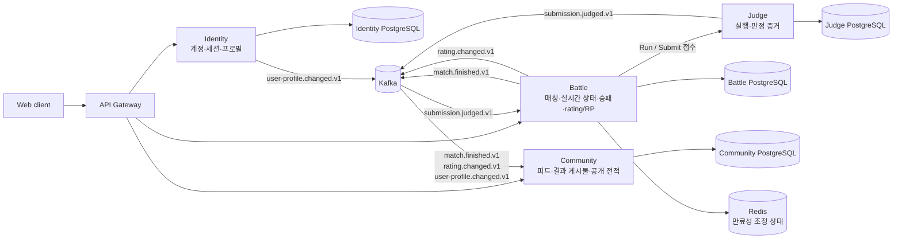

# D³ 한 장 개요

Owner: 윤서진

Status: 첫 방문자용 개요; 로컬 P0 골든 패스 리허설 실증, 최종 인수·배포 증거는 PENDING

Last verified: 2026-08-19 against `2915d0f`, frozen `25359ad` rehearsal and [artifact status](artifact-status.md)

## 왜 이 제품을 만드는가

개발자의 코딩 활동은 보통 풀이 사이트, 커뮤니티, 전적 페이지에 흩어져 있습니다. D³(Dopamin-Driven Development)는 이 단절을 줄이기 위해 **개발자 마이크로블로그(SNS)와 1:1 실시간 경쟁 코딩 배틀을 하나의 경험으로 연결한 프로토타입**입니다.

사용자는 글과 코드를 공개 피드에 올리고, 같은 언어를 선택한 상대와 랭크 배틀을 치릅니다. 서버가 실행 결과와 승패를 확정하면 rating/RP가 반영되고 결과 게시물과 공개 전적이 생깁니다. 즉, “코드를 작성한다 → 겨룬다 → 결과가 개발자 정체성과 커뮤니티에 남는다”가 제품의 핵심 메시지입니다.

## 골든 패스 사용자 여정

1. 계정을 만들거나 로그인합니다. **WF-01 — Sign in** (`/sign-in`)
2. 공개 피드에서 fenced code를 포함한 Markdown 글을 읽고 발행합니다. **WF-02 — Community feed** (`/feed`)
3. 언어를 선택하고 같은 언어의 상대를 기다립니다. **WF-03 — Ranked matchmaking** (`/ranked`)
4. 서버가 관리하는 시간과 상태를 따라 코드를 Run/Submit하고, 경고가 있는 공격을 주고받습니다. 끊겼다가 돌아와도 최신 상태를 다시 받습니다. **WF-04 — Active battle** (`/battles/:matchId`)
5. 판정이 끝나면 승패와 공개 매치 기록을 확인합니다. 이때 rating과 별도의 시즌 RP가 반영됩니다. **WF-05 — Match result** (`/results/:matchId`)
6. 자동 생성된 공개 결과 게시물로 피드가 이어지고, 플레이어의 공개 전적에서 해당 매치를 다시 찾습니다. **WF-02 — Community feed**, **WF-06 — Player record** (`/players/:playerId`)

## 아키텍처 한 장

브라우저 요청은 Gateway 한 곳으로 들어갑니다. 네 도메인 서비스는 각자 데이터와 규칙을 소유하고 각자의 PostgreSQL에만 기록합니다. Kafka 이벤트는 한 서비스에서 확정된 사실을 다른 서비스의 조회 모델로 전달하며, Redis는 매칭과 실시간 조정처럼 만료되어도 복구 가능한 상태에만 사용합니다.

- **Identity**는 로그인 자격과 공개 프로필의 원본입니다.
- **Battle**은 경기 상태, 승패, rating/RP의 원본입니다.
- **Judge**는 비공개 소스 실행과 판정 증거를 맡으며, 승패를 정하지 않습니다.
- **Community**는 이벤트를 받아 공개 피드·결과·프로필 조회 모델을 만듭니다.

## 무엇이 증명됐고 무엇이 남았나

| 구분 | 현재 확인된 사실 | 남은 증거 |
|---|---|---|
| 로컬 골든 패스 | frozen revision `25359ad`에서 두 브라우저 세션으로 로그인 → 피드 발행 → 동일 언어 매칭 → Run/Submit·재접속 → 결과 → rating/RP → 자동 결과 게시물·공개 전적까지 리허설했습니다. 로컬 판정은 deterministic fake judge를 사용했습니다. 이후 #89 heartbeat/reconnect와 #96 self-verdict/accepted lock이 병합됐습니다. | delta를 포함한 final `2915d0f` 인수와 라벨이 포함된 시연 녹화는 **PENDING**입니다. |
| 서비스 경계와 데이터 | Gateway와 네 도메인 서비스가 동작하며, 서비스별 PostgreSQL과 Kafka outbox→inbox 흐름을 사용합니다. Community의 결과·rating·프로필 projection과 handle 검색까지 구현됐고 issue #17은 closed입니다. | 배포 환경에서의 전체 서비스 통합·운영 증거는 **PENDING**입니다. |
| 실시간 배틀 | 서버 권위 시간·상태, Run/Submit, 재접속 경로를 두 세션 리허설에서 확인했고, #89 heartbeat/reconnect 및 #96 self-only verdict/accepted lock이 병합됐습니다. | final RC delta 인수와 공격 교환·Surrender의 라이브 실증은 **PENDING/NOT RUN**이며, 부하·장애·장시간 연결 검증도 남아 있습니다. |
| Judge0 경계 | 격리된 AWS Judge0 호스트, production adapter의 6개 런타임과 exact source-SG route smoke가 issue #59에서 **PASS**했습니다. | 애플리케이션 클라우드 배포와 deployed judge-service→Judge0 통합 실행은 **NOT RUN**입니다. |
| 선택 기능(P1) | 핵심 P0와 분리해 문서에 범위를 명시했습니다. | OAuth 연결, 비랭크 방, 솔로 연습 완성, 팔로우·댓글·좋아요, 확장 통계 등은 **PENDING**입니다. |

`PASS`는 위에 적은 환경과 경로에서 관찰했다는 뜻이며, 프로덕션 배포 완료를 뜻하지 않습니다. 전체 산출물의 권위 있는 상태는 [artifact status](artifact-status.md)에서 확인할 수 있습니다.

## 더 읽기

- [MVP 요구사항과 현재 증거](specs/d3-mvp.md) — 무엇을 만들기로 했고 각 항목이 어디까지 확인됐는지
- [골든 패스 워크플로](architecture/workflow.md) — 사용자·서비스·이벤트의 시간 순서
- [시스템 컨텍스트](architecture/system-context.md) / [서비스 경계](architecture/services.md) — 구성 요소와 책임 분리
- [데이터 모델](architecture/erd.dbml) — 서비스별 PostgreSQL 소유 모델
- [WF-01~WF-08 와이어프레임](wireframes/README.md) — 화면별 정보 구조와 기능 범위
- [테스트 계획](quality/test-plan.md) — 단위·통합·부하·장애 검증 계획
- [배포 계획](operations/deployment-plan.md) / [데모 실행 절차](operations/demo-runbook.md) — 실행, preflight, 복구와 시연 절차
- [공개 계약 인덱스](../contracts/README.md) — HTTP·WebSocket·Kafka 계약
